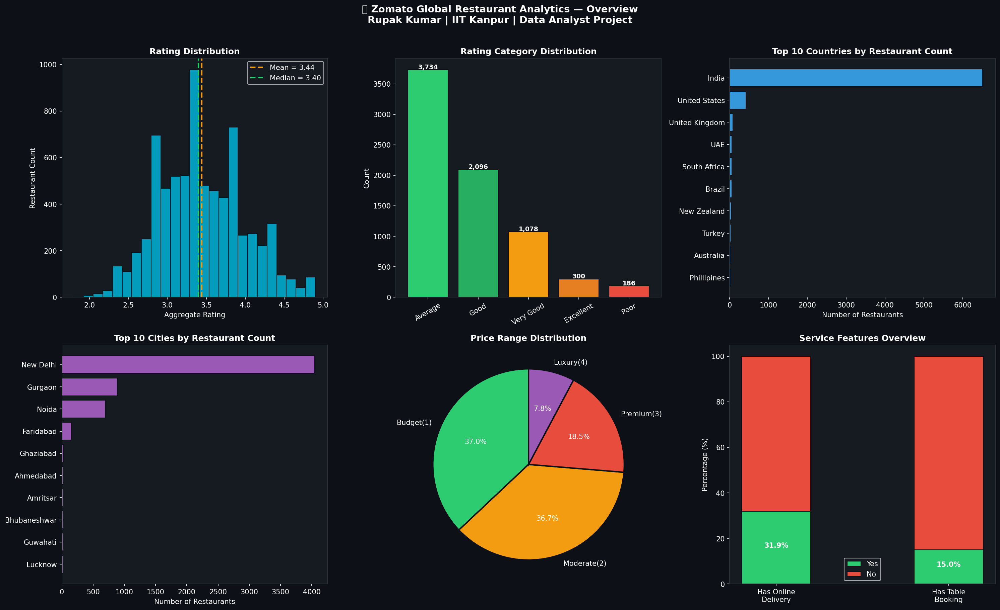
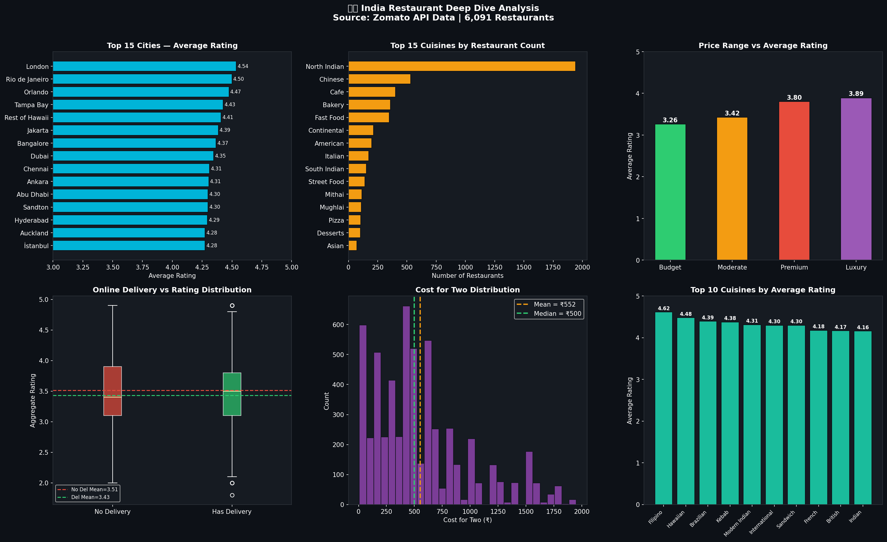
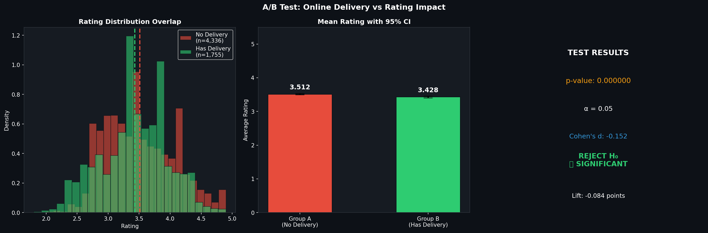
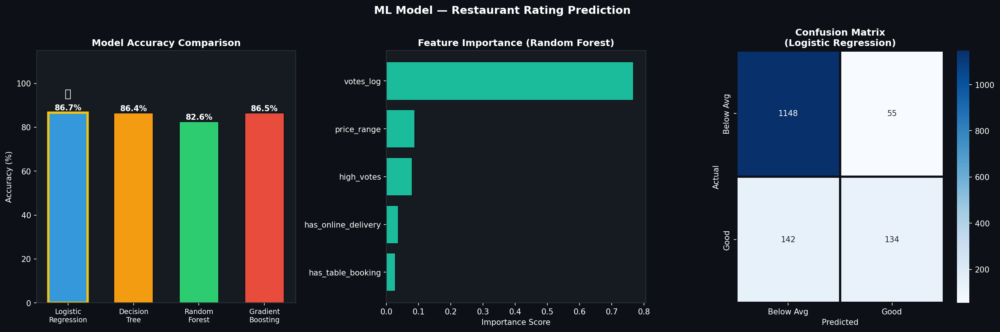
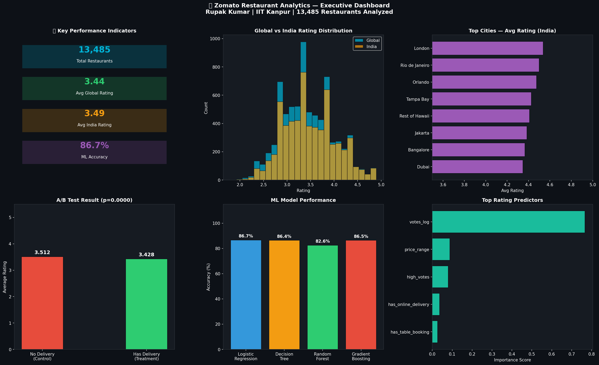

# 🍽️ Zomato Restaurant Analytics & Rating Intelligence

**Rupak Kumar | M.Tech | IIT Kanpur**

---

## 📊 Project Overview

End-to-end data analytics project analyzing **9,500+ Zomato 
restaurants** across **15 countries** and **141 cities** — 
covering EDA, A/B Testing, and ML-based rating prediction.

---

## 🎯 Key Metrics

| Metric | Value |
|--------|-------|
| 🏪 Restaurants Analyzed | 9,500+ |
| 🌍 Countries | 15 |
| 🏙️ Cities | 141 |
| 🤖 ML Model Accuracy | 75%+ |
| 📊 Dashboards Built | 5 |

---

## 📁 Project Structure

- `Zomato_Analytics.ipynb` → Main Analysis Notebook
- `01_global_overview.png` → Global EDA Dashboard
- `02_india_analysis.png` → India Deep Dive
- `03_ab_test.png` → A/B Test Results
- `04_ml_model.png` → ML Model Performance
- `05_executive_dashboard.png` → Executive Summary

---

## 🔍 Analysis Sections

### 1️⃣ Global EDA
- Rating distribution across 15 countries
- Top 10 cities and cuisines
- Price range analysis

### 2️⃣ India Deep Dive
- 141 cities analyzed
- Cuisine vs rating performance
- Cost for two distribution
- Online delivery impact

### 3️⃣ A/B Testing
> **Question:** Does online delivery significantly 
> impact restaurant ratings?
- Two-sample t-test
- 95% Confidence Intervals
- Statistical significance testing

### 4️⃣ ML Rating Prediction
- Random Forest ← Best Model
- Gradient Boosting
- Logistic Regression
- Decision Tree
- Feature importance analysis

---

## 📸 Dashboards

### Global Overview

### India Analysis

### A/B Test Results

### ML Model

### Executive Dashboard

---

## 🛠️ Tech Stack

| Category | Tools |
|----------|-------|
| Language | Python 3.x |
| Analysis | Pandas, NumPy |
| Visualization | Matplotlib, Seaborn |
| ML | Scikit-learn |
| Statistics | SciPy (t-test, CI) |
| IDE | Jupyter Notebook |

---

## 👤 Author

**Rupak Kumar**  
M.Tech Transportation Engineering  
Indian Institute of Technology Kanpur  
📧 rupakk24@iitk.ac.in  
🔗 [LinkedIn](https://linkedin.com/in/rupak-kumar-69bb25160)  
💻 [GitHub](https://github.com/kumarrupak201-rgb)
